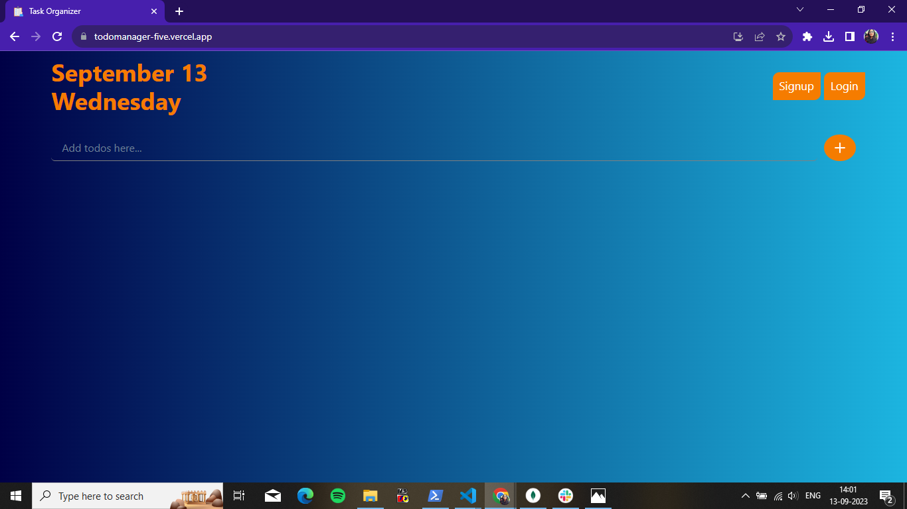
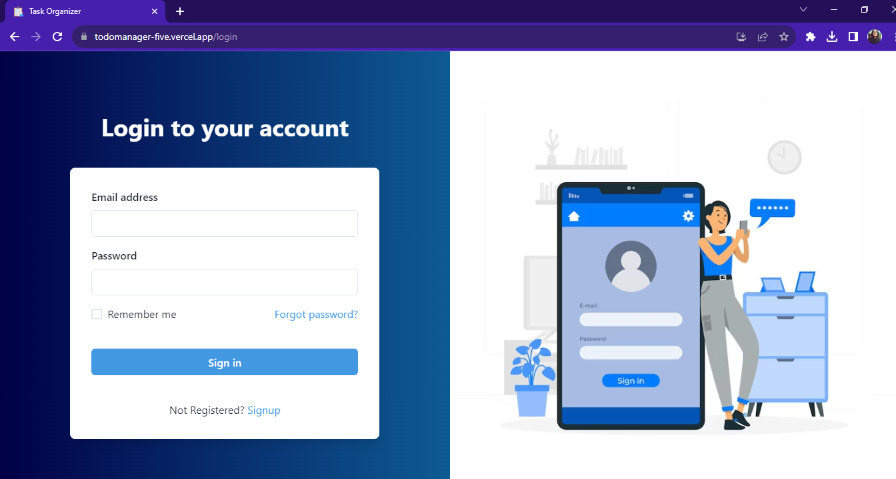

# Full-Stack Todo Application

A simple full-stack todo application built with React, Redux, TypeScript, Express, Node.js, and MongoDB.


<!--  -->

## Table of Contents

- [Demo](#demo)
- [Features](#features)
- [Getting Started](#getting-started)
  - [Prerequisites](#prerequisites)
  - [Installation](#installation)
- [Usage](#usage)
- [Technologies Used](#technologies-used)

## Demo 
Check out the live demo of the application [here](https://todomanager-five.vercel.app/).

## Features

- Add, edit, and delete todos.
- Mark todos as completed.
- Search and filter todos.
- Pagination for a better user experience.
- User authentication and authorization.


## Getting Started

### Prerequisites

- Node.js and npm installed on your machine.
- MongoDB database connection.
- Create a `.env` file in the backend directory with the following variables:
  - `DB_URI`: MongoDB database connection URI.
  - `JWT_SECRET`: Secret key for JWT authentication.

### Installation

1. Clone the repository:

   ```bash
   git clone https://github.com/yourusername/full-stack-todo-app.git

Navigate to the frontend directory:
cd full-stack-todos/frontend

Install the dependencies:
npm install

Start the frontend development server:npm start


Usage
Create an account or log in if you already have one.
Add, edit, or delete your todos.
Mark todos as completed or pending.
Search for specific todos.
Navigate through paginated todo lists.
Enjoy organizing your tasks efficiently!


## Technologies Used

- Frontend:
  - React for building user interfaces
  - Redux for state management
  - TypeScript for type safety
  - Chakra UI for styling
  - Axios for API requests

- Backend:
  - Node.js with Express for the server
  - MongoDB for data storage
  - Mongoose for MongoDB object modeling
  - JSON Web Tokens (JWT) for authentication
